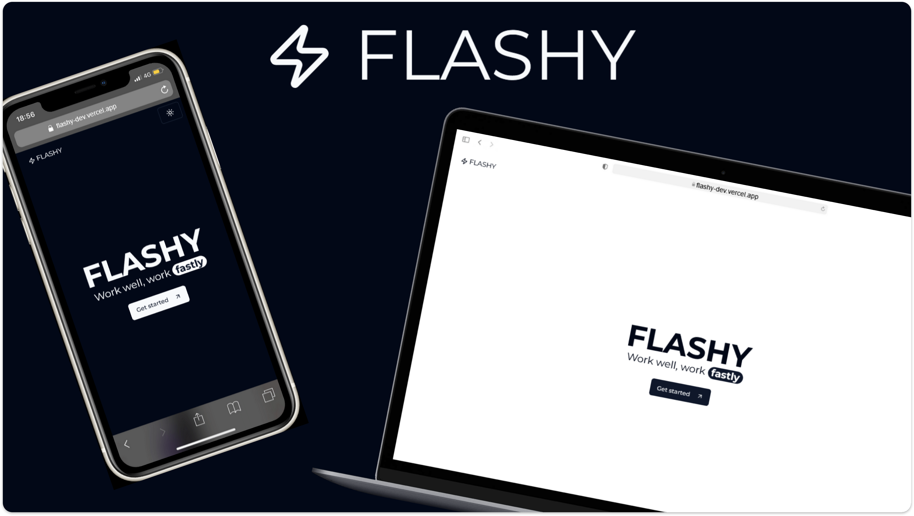

# Flashy

Tool to help developers memorize and master essential keyboard shortcuts for their primary IDE, boosting productivity and workflow efficiency.

## Roadmap

Feel free to check out our [⚡ Flashy Roadmap ⚡](https://trello.com/b/ONlLA9E7/) if you're interested in upcoming features or future plans. If you encounter any issues, please report them via our [issue tracker](https://github.com/Ryuka25/flashy/issues). We also welcome suggestions and feature requests to help improve the project.

## Contributing

Before contributing, please make sure to review our [Contributing Guide](/CONTRIBUTING.md) for detailed guidelines.

## License

This project is licensed under the [Apache-2.0 license](/LICENSE).
